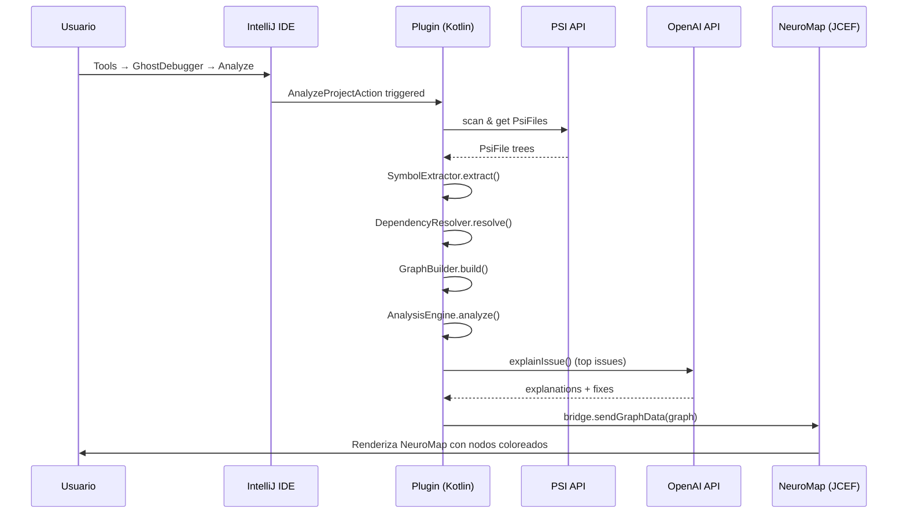
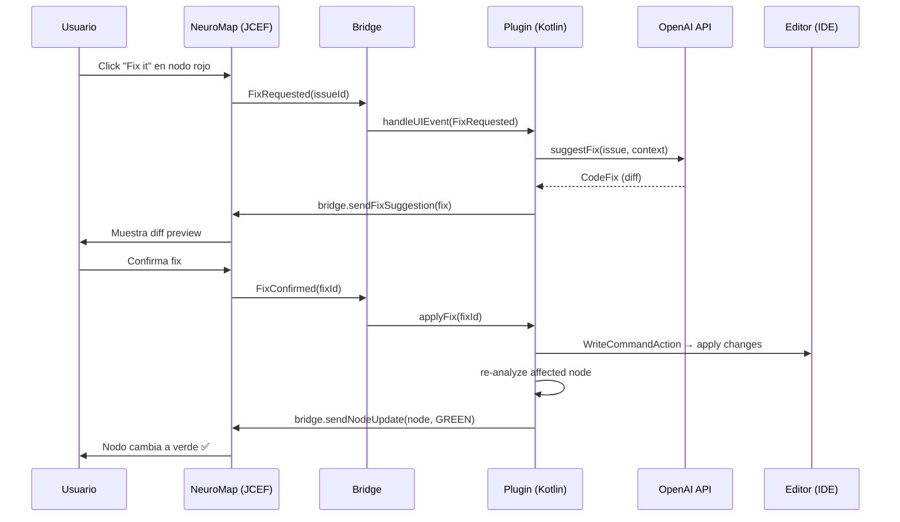

# 🏗️ Arquitectura Técnica — GhostDebugger

**Versión:** 2.0 (Kotlin / JetBrains Plugin)  
**Fecha:** 2026-04-11  

---

## 1. Visión General

GhostDebugger es un **plugin para la plataforma IntelliJ** que se ejecuta dentro del IDE. Toda la lógica del motor (parsing, análisis, grafo, IA) está escrita en **Kotlin**, mientras que la visualización del NeuroMap se renderiza en un **JCEF panel** (Chromium embebido en el IDE) usando **React Flow**.

```
┌───────────────────────────────────────────────────────────────┐
│                  JetBrains IDE (IntelliJ Platform)             │
│                                                               │
│  ┌────────────────────────────────────────────────────────┐   │
│  │              PLUGIN CORE (Kotlin/JVM)                   │   │
│  │                                                        │   │
│  │  ┌──────────┐  ┌──────────┐  ┌─────────────────────┐  │   │
│  │  │ Parser   │  │  Graph   │  │  Analysis Engine    │  │   │
│  │  │(PSI API) │  │  Builder │  │  (Heurísticas)      │  │   │
│  │  └──────────┘  └──────────┘  └─────────────────────┘  │   │
│  │  ┌──────────┐  ┌──────────┐  ┌─────────────────────┐  │   │
│  │  │OpenAI    │  │   Fix    │  │  Impact / Simulate  │  │   │
│  │  │Service   │  │  Applier │  │     Engine          │  │   │
│  │  └──────────┘  └──────────┘  └─────────────────────┘  │   │
│  └───────────────────┬────────────────────────────────────┘   │
│                      │ JCEF Bridge (postMessage / JSON)        │
│  ┌───────────────────┴────────────────────────────────────┐   │
│  │            NEUROMAP UI (JCEF Browser Panel)             │   │
│  │         React + TypeScript + React Flow + Tailwind      │   │
│  └────────────────────────────────────────────────────────┘   │
│                                                               │
│  ┌────────────────────────────────────────────────────────┐   │
│  │         INTELLIJ NATIVE UI (Tool Windows / Panels)      │   │
│  │  Detail Panel • Status Bar • Actions • Notifications    │   │
│  └────────────────────────────────────────────────────────┘   │
└───────────────────────────────────────────────────────────────┘
```

---

## 2. Stack Tecnológico

### Plugin Core (Kotlin)
| Tecnología | Versión | Propósito |
|---|---|---|
| Kotlin | 2.0.x | Lenguaje principal del plugin |
| IntelliJ Platform SDK | 2024.x+ | API del IDE, PSI, Tool Windows, Actions |
| IntelliJ Platform Gradle Plugin | 2.x | Build y packaging del plugin |
| OkHttp / Ktor Client | 5.x / 3.x | HTTP client para llamadas a OpenAI |
| Kotlinx Serialization | 1.7.x | Serialización JSON |
| Kotlinx Coroutines | 1.9.x | Async/concurrencia |
| JCEF (JBCefBrowser) | Built-in | Chromium embebido para UI web |

### NeuroMap Frontend (Web embebido en JCEF)
| Tecnología | Versión | Propósito |
|---|---|---|
| React | 19.x | Framework UI |
| TypeScript | 5.x | Tipado estático |
| Vite | 6.x | Build tool |
| React Flow (@xyflow/react) | 12.x | Visualización de grafos |
| Framer Motion | 11.x | Animaciones |
| TailwindCSS | 4.x | Estilos |

### OpenAI Integration
| Tecnología | Propósito |
|---|---|
| OpenAI API (GPT-4o) | Explicaciones humanas, fix suggestions, what-if analysis |
| API Key | Almacenada en IDE Settings (PasswordSafe) o .env |

---

## 3. Componentes del Sistema

### 3.1 Parser Engine (PSI-based)

**Responsabilidad:** Aprovechar la **IntelliJ PSI (Program Structure Interface)** para obtener la estructura del código ya parseada por el IDE.

```
Proyecto abierto en IDE  →  PSI Tree  →  Parser Engine  →  Structured Data
                             (ya disponible     (extrae          (funciones, clases,
                              en IntelliJ)       símbolos)        imports, dependencias)
```

**Ventaja clave:** No necesitamos implementar un parser propio. El IDE ya tiene el AST completo del proyecto a través de PSI.

**Clases principales:**

```kotlin
// com.ghostdebugger.parser

class FileScanner(private val project: Project) {
    /** Descubre todos los archivos relevantes del proyecto */
    fun scanFiles(extensions: Set<String> = setOf("kt", "java", "ts", "tsx", "js", "jsx")): List<PsiFile>
}

class SymbolExtractor {
    /** Extrae funciones, clases, imports de un PsiFile */
    fun extract(psiFile: PsiFile): FileSymbols
}

class DependencyResolver(private val project: Project) {
    /** Resuelve imports y dependencias entre archivos */
    fun resolveImports(symbols: List<FileSymbols>): List<DependencyRelation>
}
```

**Output:**

```kotlin
data class ParsedProject(
    val files: List<ParsedFile>,
    val symbols: List<Symbol>,
    val imports: List<ImportRelation>,
    val calls: List<CallRelation>
)

data class FileSymbols(
    val file: PsiFile,
    val functions: List<FunctionSymbol>,
    val classes: List<ClassSymbol>,
    val imports: List<ImportSymbol>,
    val exports: List<ExportSymbol>
)
```

### 3.2 Graph Builder

**Responsabilidad:** Construir el grafo de dependencias a partir de los datos parseados.

```kotlin
data class ProjectGraph(
    val nodes: List<GraphNode>,
    val edges: List<GraphEdge>,
    val metadata: GraphMetadata
)

data class GraphNode(
    val id: String,
    val type: NodeType, // FILE, FUNCTION, CLASS, COMPONENT, HOOK, API_ROUTE, MODULE
    val name: String,
    val filePath: String,
    val lineStart: Int,
    val lineEnd: Int,
    val complexity: Int,
    val status: NodeStatus, // HEALTHY, WARNING, ERROR
    val issues: List<Issue>,
    val dependencies: List<String>,
    val dependents: List<String>,
    val position: Position? = null
)

data class GraphEdge(
    val id: String,
    val source: String,
    val target: String,
    val type: EdgeType, // IMPORT, CALL, DATA_FLOW, STATE_DEPENDENCY, INHERITANCE
    val weight: Double
)

enum class NodeType { FILE, FUNCTION, CLASS, COMPONENT, HOOK, API_ROUTE, MODULE }
enum class NodeStatus { HEALTHY, WARNING, ERROR }
enum class EdgeType { IMPORT, CALL, DATA_FLOW, STATE_DEPENDENCY, INHERITANCE }
```

### 3.3 Analysis Engine

**Responsabilidad:** Analizar el grafo y detectar errores, riesgos y problemas.

**Interfaz de Analyzer:**

```kotlin
interface Analyzer {
    val name: String
    fun analyze(context: AnalysisContext): List<Issue>
}

data class AnalysisContext(
    val graph: ProjectGraph,
    val project: Project,
    val parsedProject: ParsedProject
)
```

**Analyzers implementados:**

| Analyzer | Detecta |
|---|---|
| `NullSafetyAnalyzer` | Variables potencialmente null/undefined |
| `CircularDependencyAnalyzer` | Dependencias circulares entre módulos |
| `AsyncFlowAnalyzer` | Problemas con coroutines, async/await, promesas |
| `ComplexityAnalyzer` | Funciones con alta complejidad ciclomática |
| `DeadCodeAnalyzer` | Código muerto o no referenciado |
| `StateInitAnalyzer` | Estados usados antes de inicializarse |
| `ImpactAnalyzer` | Calcula impacto de un cambio en un nodo |

**Engine:**

```kotlin
class AnalysisEngine(private val analyzers: List<Analyzer>) {
    
    suspend fun analyze(context: AnalysisContext): AnalysisResult {
        val issues = analyzers.flatMap { analyzer ->
            try {
                analyzer.analyze(context)
            } catch (e: Exception) {
                logger.warn("Analyzer ${analyzer.name} failed", e)
                emptyList()
            }
        }
        
        return AnalysisResult(
            issues = issues,
            metrics = calculateMetrics(context.graph, issues),
            hotspots = findHotspots(context.graph, issues),
            risks = identifyRisks(context.graph, issues)
        )
    }
}
```

### 3.4 AI Integration Layer (OpenAI)

**Responsabilidad:** Conectar con **OpenAI GPT-4o** para generar explicaciones humanas, fixes y respuestas "what if".

```kotlin
class OpenAIService(
    private val apiKey: String,
    private val model: String = "gpt-4o",
    private val httpClient: OkHttpClient = OkHttpClient()
) {
    /** Explicar un error en lenguaje humano */
    suspend fun explainIssue(issue: Issue, context: CodeContext): String
    
    /** Generar un fix contextual */
    suspend fun suggestFix(issue: Issue, context: CodeContext): CodeFix
    
    /** Explicar el sistema completo */
    suspend fun explainSystem(graph: ProjectGraph): SystemSummary
    
    /** Responder preguntas "what if" */
    suspend fun whatIf(question: String, graph: ProjectGraph): WhatIfResponse
    
    /** Generar test para reproducir un bug */
    suspend fun generateTest(issue: Issue, context: CodeContext): String
}
```

**Configuración de OpenAI:**

```kotlin
data class OpenAIConfig(
    val apiKey: String,          // Almacenada en IDE PasswordSafe
    val model: String = "gpt-4o",
    val baseUrl: String = "https://api.openai.com/v1",
    val maxTokens: Int = 4096,
    val temperature: Double = 0.3,
    val timeout: Duration = 30.seconds
)
```

**Estrategia de prompts:**

- **Contexto:** Se envía al LLM un resumen del grafo + código relevante
- **Chunking:** Se seleccionan solo los archivos y funciones relevantes para no exceder el context window
- **Templates:** Prompts pre-construidos para cada tipo de función (explicar, fixear, resumir, etc.)
- **Caché:** Las respuestas se cachean por hash del código + tipo de consulta usando `ConcurrentHashMap`

**Ejemplo de prompt template:**

```kotlin
object PromptTemplates {
    fun explainIssue(issue: Issue, codeSnippet: String, context: String) = """
        You are a senior software developer explaining a bug to a teammate.
        
        ## Issue
        Type: ${issue.type}
        File: ${issue.filePath}
        Line: ${issue.line}
        
        ## Code
        ```
        $codeSnippet
        ```
        
        ## Project Context
        $context
        
        Explain this issue in simple, clear language. Include:
        1. WHAT is happening
        2. WHY it happens
        3. WHEN/WHERE it manifests (the scenario)
        4. What components are AFFECTED
        
        Respond in Spanish. Be concise but thorough.
    """.trimIndent()
}
```

### 3.5 JCEF Bridge (Kotlin ↔ Web UI)

**Responsabilidad:** Comunicación bidireccional entre el plugin Kotlin y el frontend React embebido en JCEF.

```kotlin
class JcefBridge(private val browser: JBCefBrowser) {
    
    /** Enviar datos del grafo al frontend */
    fun sendGraphData(graph: ProjectGraph) {
        val json = Json.encodeToString(graph)
        browser.cefBrowser.executeJavaScript(
            "window.__ghostdebugger__.onGraphUpdate($json)", null, 0
        )
    }
    
    /** Enviar explicación de un issue */
    fun sendIssueExplanation(issueId: String, explanation: String) {
        val payload = Json.encodeToString(mapOf("issueId" to issueId, "explanation" to explanation))
        browser.cefBrowser.executeJavaScript(
            "window.__ghostdebugger__.onExplanation($payload)", null, 0
        )
    }
    
    /** Registrar handlers para mensajes del frontend → Kotlin */
    fun registerHandlers() {
        val query = JBCefJSQuery.create(browser as JBCefBrowserBase)
        
        query.addHandler { message ->
            val event = Json.decodeFromString<UIEvent>(message)
            handleUIEvent(event)
            JBCefJSQuery.Response("ok")
        }
    }
}

@Serializable
sealed class UIEvent {
    @Serializable data class NodeClicked(val nodeId: String) : UIEvent()
    @Serializable data class FixRequested(val issueId: String) : UIEvent()
    @Serializable data class SimulateRequested(val entryNodeId: String) : UIEvent()
    @Serializable data class WhatIfQuestion(val question: String) : UIEvent()
    @Serializable data class ImpactRequested(val nodeId: String) : UIEvent()
}
```

### 3.6 IntelliJ Plugin Integration

**Plugin Actions:**

```kotlin
// Acción principal — lanzar análisis
class AnalyzeProjectAction : AnAction("Analyze with GhostDebugger") {
    override fun actionPerformed(e: AnActionEvent) {
        val project = e.project ?: return
        CoroutineScope(Dispatchers.Default).launch {
            GhostDebuggerService.getInstance(project).analyzeProject()
        }
    }
}

// Tool Window — panel del NeuroMap
class GhostDebuggerToolWindowFactory : ToolWindowFactory {
    override fun createToolWindowContent(project: Project, toolWindow: ToolWindow) {
        val neuroMapPanel = NeuroMapPanel(project)
        val content = ContentFactory.getInstance().createContent(neuroMapPanel, "NeuroMap", false)
        toolWindow.contentManager.addContent(content)
    }
}
```

**Plugin Descriptor (`plugin.xml`):**

```xml
<idea-plugin>
    <id>com.ghostdebugger</id>
    <name>GhostDebugger</name>
    <vendor>GhostDebugger Team</vendor>
    <description>
        Intelligent debugging system that understands, predicts, 
        and fixes code like a senior developer.
    </description>
    
    <depends>com.intellij.modules.platform</depends>
    
    <extensions defaultExtensionNs="com.intellij">
        <toolWindow id="GhostDebugger" 
                    secondary="true" 
                    anchor="right"
                    factoryClass="com.ghostdebugger.toolwindow.GhostDebuggerToolWindowFactory"
                    icon="/icons/ghost.svg"/>
        
        <projectService serviceImplementation="com.ghostdebugger.GhostDebuggerService"/>
        
        <notificationGroup id="GhostDebugger" 
                           displayType="BALLOON"/>
    </extensions>
    
    <actions>
        <group id="GhostDebugger.Menu" text="GhostDebugger" popup="true">
            <add-to-group group-id="ToolsMenu" anchor="last"/>
            
            <action id="GhostDebugger.Analyze"
                    class="com.ghostdebugger.actions.AnalyzeProjectAction"
                    text="Analyze Project"
                    description="Analyze entire project with GhostDebugger"
                    icon="/icons/analyze.svg">
                <keyboard-shortcut keymap="$default" first-keystroke="ctrl alt G"/>
            </action>
            
            <action id="GhostDebugger.ExplainSystem"
                    class="com.ghostdebugger.actions.ExplainSystemAction"
                    text="Explain System"
                    description="Get an AI-powered explanation of the project architecture"/>
        </group>
    </actions>
</idea-plugin>
```

### 3.7 NeuroMap Frontend

**Responsabilidad:** Visualización interactiva del grafo embebida en JCEF.

**Componentes principales:**

```
App
├── NeuroMap (React Flow graph)
│   ├── CustomNode (nodo con estado y color)
│   ├── CustomEdge (conexión con animación)
│   ├── MiniMap
│   └── Controls (zoom, fit, filter)
├── DetailPanel (panel lateral)
│   ├── NodeInfo
│   ├── IssueExplanation
│   ├── FixSuggestion (con diff view)
│   └── ImpactAnalysis
├── StatusBar (resumen del proyecto)
├── SimulationOverlay (animación de flujo)
└── WhatIfChat (chat para preguntas CTO)
```

**Bridge desde JS:**

```typescript
// En el frontend, recibir datos del plugin Kotlin
window.__ghostdebugger__ = {
  onGraphUpdate: (data: ProjectGraph) => {
    useGraphStore.getState().setGraph(data);
  },
  onExplanation: (data: { issueId: string; explanation: string }) => {
    useIssueStore.getState().setExplanation(data.issueId, data.explanation);
  },
  // ... más handlers
};

// Enviar eventos al plugin Kotlin
const sendToPlugin = (event: UIEvent) => {
  window.__jcefQuery__(JSON.stringify(event));
};
```

---

## 4. Flujo de Datos

### 4.1 Análisis inicial



### 4.2 Fix de un error



---

## 5. Modelo de Datos

### 5.1 Grafo en memoria

```kotlin
class InMemoryGraph {
    private val nodes = ConcurrentHashMap<String, GraphNode>()
    private val edges = ConcurrentHashMap<String, GraphEdge>()
    private val adjacencyList = ConcurrentHashMap<String, MutableSet<String>>()
    private val reverseAdjacencyList = ConcurrentHashMap<String, MutableSet<String>>()

    fun addNode(node: GraphNode)
    fun addEdge(edge: GraphEdge)
    fun getNode(id: String): GraphNode?
    fun getNeighbors(id: String): List<GraphNode>
    fun getDependents(id: String): List<GraphNode>
    fun getSubgraph(nodeId: String, depth: Int): ProjectGraph
    fun findCycles(): List<List<String>>
    fun findPath(from: String, to: String): List<String>?
    fun calculateImpact(nodeId: String): ImpactResult
    fun toProjectGraph(): ProjectGraph
}
```

### 5.2 Caché de IA

```kotlin
class AICache(private val ttlSeconds: Long = 3600) {
    private val cache = ConcurrentHashMap<String, CacheEntry>()
    
    data class CacheEntry(
        val response: String,
        val createdAt: Instant,
        val ttl: Duration
    )
    
    fun get(key: String): String?
    fun put(key: String, response: String)
    fun computeKey(code: String, promptType: String): String // SHA-256 hash
}
```

---

## 6. Estrategia de Análisis

### 6.1 Pipeline de análisis

```
1. File Discovery (FileScanner + PSI)
   ↓
2. Symbol Extraction (PSI tree traversal)
   ↓
3. Dependency Resolution (import/reference resolution)
   ↓
4. Graph Construction (InMemoryGraph)
   ↓
5. Static Analysis (Analyzers / heurísticas)
   ↓
6. AI Enhancement (OpenAI — explicaciones + fixes)
   ↓
7. Result Aggregation + UI Update (JCEF bridge)
```

### 6.2 Reglas heurísticas (análisis estático sin IA)

| Regla | Tipo | Descripción |
|---|---|---|
| `null-after-async` | Error | Variable usada sin null-check después de operación asíncrona |
| `circular-import` | Warning | Módulos que se importan mutuamente |
| `unused-export` | Info | Exports/public que nadie usa |
| `unhandled-exception` | Error | Excepción no capturada, promesa sin catch |
| `state-before-init` | Error | Estado leído antes de ser inicializado |
| `high-complexity` | Warning | Función con complejidad ciclomática > 10 |
| `high-coupling` | Warning | Módulo con > 15 dependencias |
| `dead-code` | Info | Funciones/variables no referenciadas |
| `missing-error-handling` | Warning | Componente/función sin manejo de errores |
| `resource-leak` | Error | Recurso abierto sin cerrar (streams, connections) |

---

## 7. OpenAI Integration Details

### 7.1 API Calls

Todas las llamadas a OpenAI se hacen desde Kotlin usando **OkHttp** o **Ktor Client**:

```kotlin
suspend fun callOpenAI(prompt: String): String {
    val request = ChatCompletionRequest(
        model = config.model,
        messages = listOf(
            ChatMessage(role = "system", content = SYSTEM_PROMPT),
            ChatMessage(role = "user", content = prompt)
        ),
        maxTokens = config.maxTokens,
        temperature = config.temperature
    )
    
    val response = httpClient.post("${config.baseUrl}/chat/completions") {
        header("Authorization", "Bearer ${config.apiKey}")
        contentType(ContentType.Application.Json)
        setBody(Json.encodeToString(request))
    }
    
    return response.body<ChatCompletionResponse>().choices.first().message.content
}
```

### 7.2 Rate Limiting & Error Handling

```kotlin
class RateLimitedOpenAIService(
    private val delegate: OpenAIService,
    private val maxRequestsPerMinute: Int = 20
) {
    private val semaphore = Semaphore(maxRequestsPerMinute)
    
    suspend fun <T> withRateLimit(block: suspend () -> T): T {
        semaphore.acquire()
        try {
            return block()
        } finally {
            delay(60_000L / maxRequestsPerMinute)
            semaphore.release()
        }
    }
}
```

### 7.3 API Key Storage

La API key de OpenAI se almacena de forma segura usando el **PasswordSafe** de IntelliJ:

```kotlin
object ApiKeyManager {
    private const val SERVICE_NAME = "GhostDebugger"
    private const val KEY_NAME = "OPENAI_API_KEY"
    
    fun getApiKey(): String? {
        val credentials = PasswordSafe.instance.get(
            CredentialAttributes(SERVICE_NAME, KEY_NAME)
        )
        return credentials?.getPasswordAsString()
    }
    
    fun setApiKey(key: String) {
        PasswordSafe.instance.set(
            CredentialAttributes(SERVICE_NAME, KEY_NAME),
            Credentials(KEY_NAME, key)
        )
    }
}
```

---

## 8. Seguridad

- **API Key de OpenAI:** Almacenada en IntelliJ PasswordSafe (encriptada), nunca en código ni en archivos de texto plano
- **File System:** El plugin solo accede al proyecto abierto en el IDE
- **IA:** No se envían repositorios completos, solo fragmentos relevantes (chunking inteligente)
- **Datos locales:** Todo el análisis se ejecuta localmente en la JVM; solo las llamadas a OpenAI salen del sistema

---

## 9. Escalabilidad (futura)

### Para producto real
- Migrar grafo a **Neo4j** para repos grandes
- Usar **coroutines + Dispatchers.IO** para parsing paralelo masivo
- Implementar **incremental parsing** (solo re-parsear archivos cambiados, integrar con file watchers)
- Añadir **embeddings** del código para búsqueda semántica
- Soporte multi-lenguaje (Python, Go, Rust via PSI plugins)

### Para hackathon
- Grafo en memoria con `ConcurrentHashMap`
- Parsing secuencial con coroutines básicas
- Sin persistencia (re-analiza al recargar)
- Llamadas directas a OpenAI sin cola

---

## 10. Estructura de Directorios

```
ghostdebugger/
├── src/main/kotlin/com/ghostdebugger/
│   ├── GhostDebuggerService.kt        # Servicio principal del plugin
│   ├── parser/                         # Motor de parsing (PSI)
│   │   ├── FileScanner.kt
│   │   ├── SymbolExtractor.kt
│   │   ├── DependencyResolver.kt
│   │   └── CallAnalyzer.kt
│   ├── graph/                          # Constructor de grafo
│   │   ├── GraphBuilder.kt
│   │   └── InMemoryGraph.kt
│   ├── analysis/                       # Motor de análisis
│   │   ├── AnalysisEngine.kt
│   │   ├── Analyzer.kt                 # Interfaz
│   │   └── analyzers/
│   │       ├── NullSafetyAnalyzer.kt
│   │       ├── CircularDependencyAnalyzer.kt
│   │       ├── AsyncFlowAnalyzer.kt
│   │       ├── ComplexityAnalyzer.kt
│   │       ├── DeadCodeAnalyzer.kt
│   │       └── StateInitAnalyzer.kt
│   ├── ai/                             # Integración con OpenAI
│   │   ├── OpenAIService.kt
│   │   ├── OpenAIConfig.kt
│   │   ├── ApiKeyManager.kt
│   │   ├── AICache.kt
│   │   └── prompts/
│   │       ├── PromptTemplates.kt
│   │       └── SystemPrompts.kt
│   ├── model/                          # Data classes compartidas
│   │   ├── GraphModels.kt
│   │   ├── AnalysisModels.kt
│   │   └── AIModels.kt
│   ├── actions/                        # IntelliJ Actions
│   │   ├── AnalyzeProjectAction.kt
│   │   ├── ExplainSystemAction.kt
│   │   └── ConfigureApiKeyAction.kt
│   ├── toolwindow/                     # Tool Window
│   │   ├── GhostDebuggerToolWindowFactory.kt
│   │   └── NeuroMapPanel.kt
│   ├── bridge/                         # JCEF ↔ Kotlin bridge
│   │   ├── JcefBridge.kt
│   │   └── UIEvent.kt
│   └── settings/                       # Plugin settings
│       ├── GhostDebuggerSettings.kt
│       └── GhostDebuggerConfigurable.kt
│
├── src/main/resources/
│   ├── META-INF/
│   │   └── plugin.xml                  # Plugin descriptor
│   ├── icons/                          # Iconos SVG del plugin
│   │   ├── ghost.svg
│   │   └── analyze.svg
│   └── web/                            # Frontend compilado (dist/)
│       ├── index.html
│       ├── assets/
│       └── ...
│
├── src/test/kotlin/com/ghostdebugger/
│   ├── parser/
│   ├── analysis/
│   ├── ai/
│   └── graph/
│
├── webview/                            # Fuentes del frontend (React)
│   ├── src/
│   │   ├── components/
│   │   │   ├── neuromap/
│   │   │   │   ├── NeuroMap.tsx
│   │   │   │   ├── CustomNode.tsx
│   │   │   │   ├── CustomEdge.tsx
│   │   │   │   └── MapControls.tsx
│   │   │   ├── detail-panel/
│   │   │   │   ├── DetailPanel.tsx
│   │   │   │   ├── IssueCard.tsx
│   │   │   │   ├── FixSuggestion.tsx
│   │   │   │   └── ImpactView.tsx
│   │   │   ├── simulation/
│   │   │   ├── layout/
│   │   │   └── shared/
│   │   ├── stores/
│   │   ├── bridge/                     # JS ↔ Kotlin bridge client
│   │   │   └── pluginBridge.ts
│   │   ├── types/
│   │   ├── App.tsx
│   │   └── main.tsx
│   ├── vite.config.ts
│   ├── tailwind.config.ts
│   ├── tsconfig.json
│   └── package.json
│
├── sample-projects/                    # Proyectos de ejemplo para demo
│   └── buggy-react-app/
│
├── docs/
├── build.gradle.kts                    # Build principal
├── settings.gradle.kts
├── gradle.properties
├── .env.example
├── .gitignore
└── README.md
```
